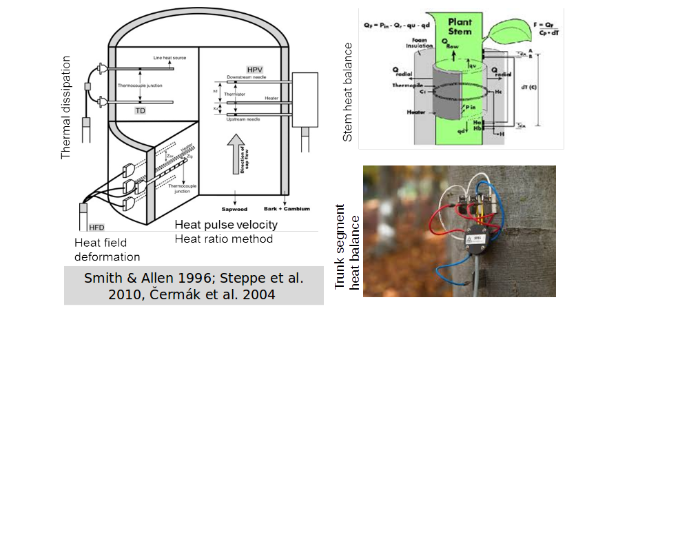
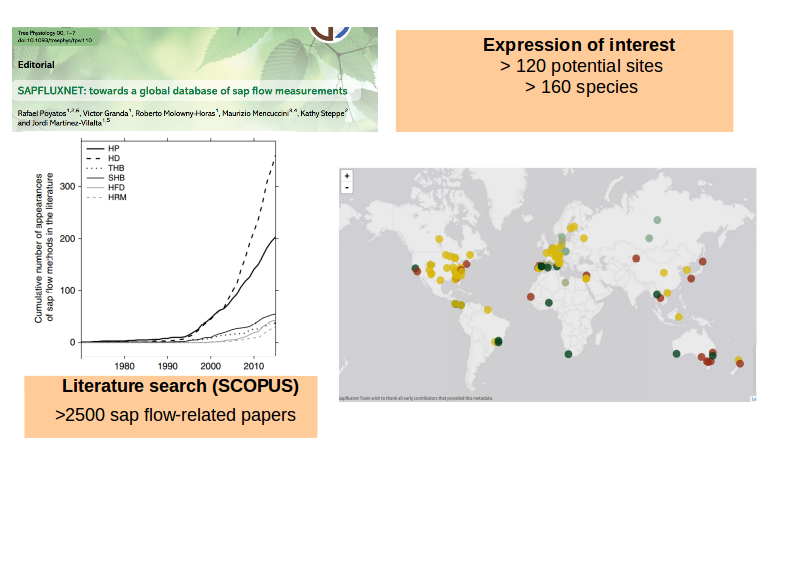
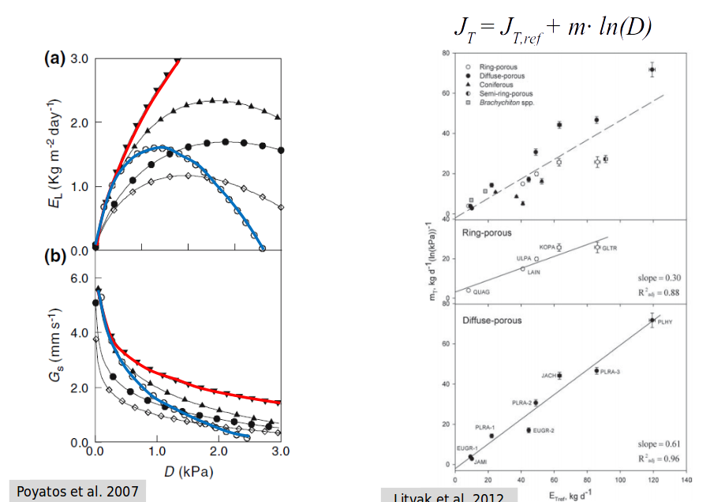
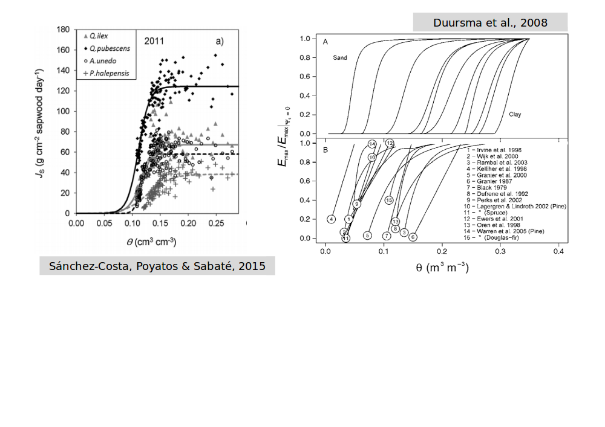

```{r setup, include=FALSE}
knitr::opts_chunk$set(echo = FALSE)
library(sapfluxnetr)
library(dplyr)
```


## La transpiración como principal flujo evaporativo global
- La transpiración representa globalmente un ~60% de la ET terrestre y los bosques transpiran un ~60% de esta ET.
 


## Regulación de la transpiración y resistencia a la sequía

- La regulación de la transpiración se refleja en la magnitud y 
los patrones temporales del flujo de savia.
 

## Medida de flujo de savia con métodos térmicos

- El flujo de savia es la medida de los patrones temporales
del uso de agua, con una mayor representatividad ecológica 
(especies,poblaciones, tamaños de planta)
 {width=80%}

## Datos globales de flujo de savia, por qué no?




## Descripción técnica

> Para poder asegurar la calidad de los datos recibidos necesitamos un control
  de calidad **semi-automático**, **reproducible** y **robusto**. También
  necesitamos, por otro lado, almacenar los datos de tal manera que permita el
  acceso a toda la información (datos y metadatos) para simplificar el proceso.


## Control de calidad


## Almacenamiento de los datos

Toda la información de un sitio (datos de flujo, datos ambientales, metadatos
de sitio, stand, especies, plantas y ambientales) se combinan en un solo
objeto, gracias a la clase S4 `sfn_data`:


## Almacenamiento de los datos

Así, es sencillo acceder a los datos de flujo, por ejemplo:

```{r, echo=TRUE}
read_sfn_data('ARG_MAZ') %>% get_sapf_data()
```

## Herramientas desarrolladas en el proyecto

Monitorización del Control de Calidad y del progreso del proyecto, gracias
a aplicaciones `shiny`:


## Herramientas desarrolladas en el proyecto

Paquetes de R para trabajar con los datos

- `sapfluxnetQC1`:  
  Encargado de toda la parte semi-automática de control de
  calidad. Destinado a uso interno del proyecto, pero auditable por cualquier
  interesado (Data contributors, Journal reviewers...):  
  https://github.com/sapfluxnet/sapfluxnetQC1

- `sapfluxnetr`:  
  Herramientas y utilidades para el análisis de los datos
  recopilados en SAPFLUXNET. Destinado al público interesado (Data contributors,
  Investigadores...) y completamente disponible:  
  https://github.com/sapfluxnet/sapfluxnetr
  
  
## Escalado del uso del agua 

SAPFLUXNET permitirá analizar la variación de la transpiración en función de 
atributos de la planta (diámetro, área de albura, área foliar).


## Respuestas a la demanda evaporativa




## Respuestas a la humedad del suelo



